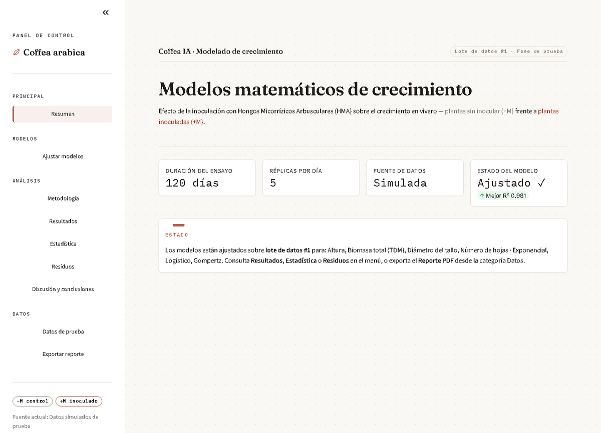
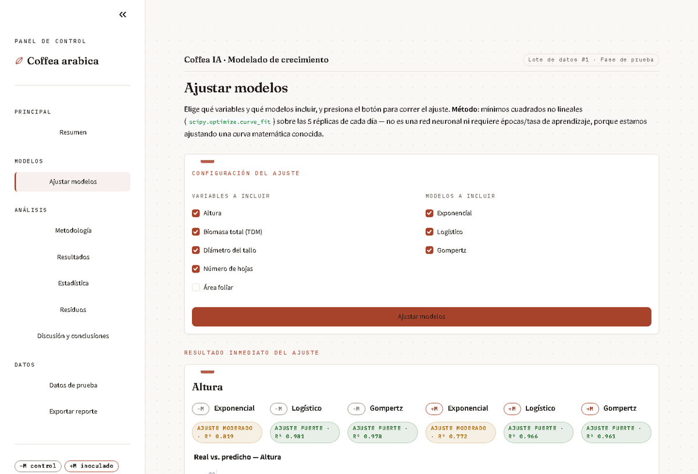
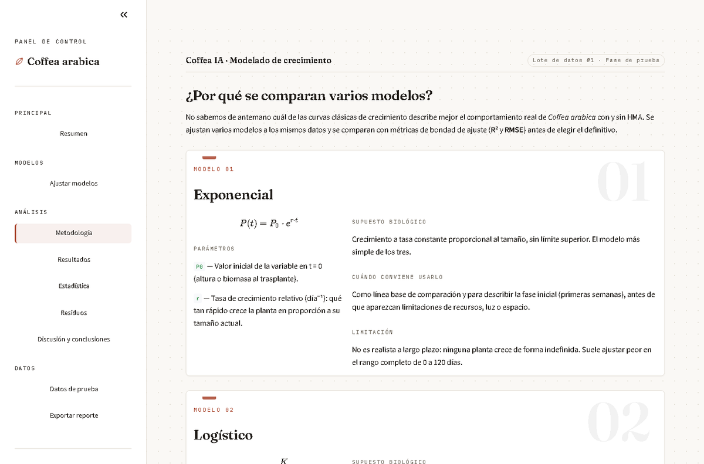
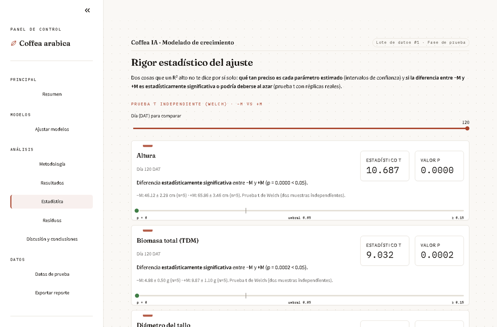
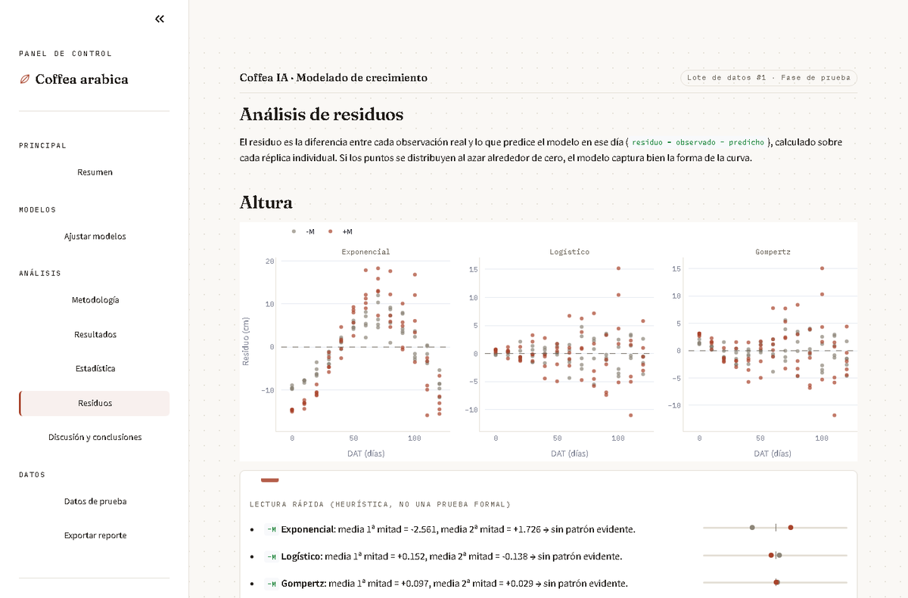
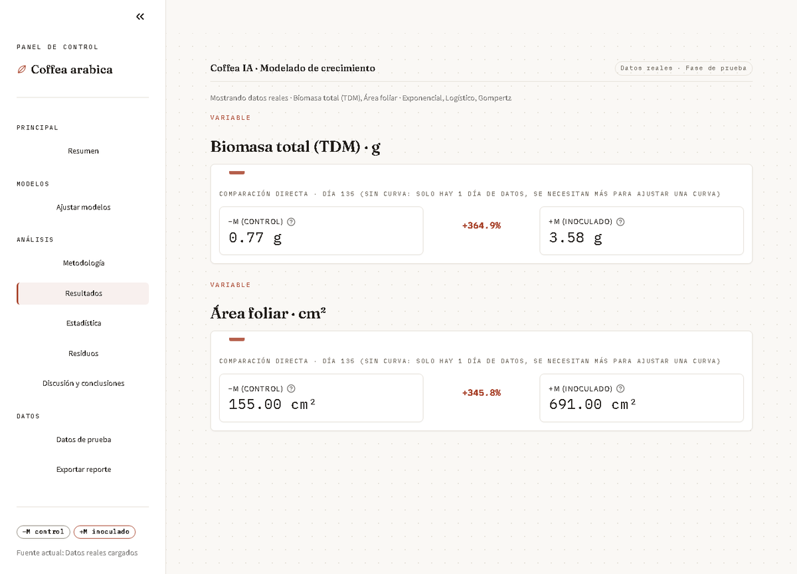

# Coffea IA · Modelado de crecimiento

Aplicación en Streamlit que ajusta y compara tres modelos matemáticos de
crecimiento (**Exponencial**, **Logístico**, **Gompertz**) sobre datos de
biomasa, área foliar, altura, diámetro del tallo y número de hojas de
*Coffea arabica*, comparando un grupo control sin inocular (**−M**) frente a
un grupo inoculado con Hongos Micorrízicos Arbusculares (**+M**).

Incluye ajuste por mínimos cuadrados no lineales, bandas de confianza al
95%, pruebas t de Welch, análisis de residuos, carga de datos propios en
formato largo (CSV/Excel) y exportación de un reporte en PDF.

## Capturas

**Resumen**



**Ajustar modelos** — configuración del ajuste y resultado inmediato con
badges de bondad de ajuste (R²) por grupo y modelo



**Metodología** — explicación de cada modelo con tratamiento editorial



**Estadística** — intervalos de confianza y prueba t de Welch entre −M y +M



**Residuos** — diagnóstico de ajuste por modelo y grupo



**Resultados con datos reales insuficientes** — cuando un dataset real solo
tiene un día de muestreo, la app avisa de inmediato y muestra una
comparación directa en vez de forzar un ajuste sin sentido



## Qué resuelve

- **Comparación de modelos**: ajusta los tres modelos a los mismos datos y
  compara con R², RMSE y MAE antes de elegir el definitivo.
- **Rigor estadístico**: no solo un R² — también intervalos de confianza
  por parámetro y una prueba t de Welch con las réplicas reales entre −M y
  +M.
- **Validación de datos honesta**: si un dataset (real o de prueba) no
  tiene suficientes días distintos de muestreo para identificar un modelo
  (Exponencial necesita ≥2 días; Logístico y Gompertz ≥3), la app lo
  advierte de inmediato al cargar el archivo y muestra un badge
  "Sin suficientes días" en vez de inventar un ajuste — nunca un R² falso.
- **Datos simulados + datos reales conviven**: mientras se completa la
  validación con datos reales para todas las variables, la app sigue
  funcionando con datos de prueba simulados (con réplicas) para las
  variables que aún faltan, sin romper el flujo.
- **Reporte reproducible**: exporta un PDF con metodología, tablas de
  parámetros y gráficas, listo para anexar a un documento.

## Fuente de los datos reales

Los datos reales incluidos (`datos_reales/datos_reales_biomasa_area_foliar.xlsx`)
corresponden a la Tabla 4 de:

> Corazon-Guivin et al. (2023), *Research Square*,
> DOI [10.21203/rs.3.rs-2878642/v1](https://doi.org/10.21203/rs.3.rs-2878642/v1)

Biomasa seca del brote y área foliar a día 135, n=34 réplicas por grupo.
Al tener un solo día de muestreo, estos datos sirven para comparar valores
puntuales entre grupos (con prueba t), pero no alcanzan para ajustar una
curva de crecimiento — la app lo señala explícitamente en vez de simularlo.

## Stack

- [Streamlit](https://streamlit.io/) — interfaz y estado de la app
- [SciPy](https://scipy.org/) (`curve_fit`) — ajuste por mínimos cuadrados no lineales
- [Plotly](https://plotly.com/python/) — gráficas interactivas
- [pandas](https://pandas.pydata.org/) / [NumPy](https://numpy.org/) — manejo de datos
- [fpdf2](https://pyfpdf.github.io/fpdf2/) — generación del reporte PDF
- [openpyxl](https://openpyxl.readthedocs.io/) — lectura/escritura de Excel

## Cómo correrla localmente

```bash
git clone https://github.com/0scar07/proyecto-coffea-hma.git
cd proyecto-coffea-hma
pip install -r app/requirements.txt
streamlit run app/app.py
```

La app abre en `http://localhost:8501`. Por defecto arranca con datos
simulados; para probar con datos reales, ve a **Datos de prueba** y sube un
archivo en el formato de la plantilla descargable (o el Excel real incluido
en `datos_reales/`).

## Estructura del proyecto

```
proyecto-coffea-hma/
├── app/
│   ├── app.py                  # app de Streamlit (única fuente de la lógica y el UI)
│   ├── requirements.txt
│   └── .streamlit/
│       └── config.toml         # tema nativo de Streamlit (paleta "Cuaderno de campo")
├── datos_reales/
│   ├── datos_reales_biomasa_area_foliar.xlsx
│   └── validacion_cruzada_real.py   # script de validación cruzada sobre los datos reales
└── docs/
    └── screenshots/             # capturas usadas en este README
```

## Desplegar en Streamlit Cloud

1. En [share.streamlit.io](https://share.streamlit.io), **New app**.
2. Repositorio: `0scar07/proyecto-coffea-hma`, rama `master`.
3. **Main file path**: `app/app.py`.
4. Deploy — Streamlit Cloud toma automáticamente `app/requirements.txt` y
   `app/.streamlit/config.toml` porque están junto al archivo principal.

Si se actualiza el código y la app desplegada no refleja los cambios,
usa **"Reboot app"** desde el menú de la app en Streamlit Cloud para forzar
un proceso nuevo (limpia cualquier caché de `@st.cache_data` que haya
quedado de una versión anterior).

## Estado y limitaciones conocidas

- Datos reales completos solo para **biomasa** y **área foliar** (un día de
  muestreo, Tabla 4 del paper citado arriba). Las demás variables (altura,
  diámetro del tallo, número de hojas) siguen usando datos simulados hasta
  contar con mediciones reales en varios días.
- Los parámetros de forma de Logístico y Gompertz (`k`, `Ti`) dependen de
  qué tan buena sea la cobertura temporal real de las mediciones — con
  pocos puntos, el ajuste pierde estabilidad.
