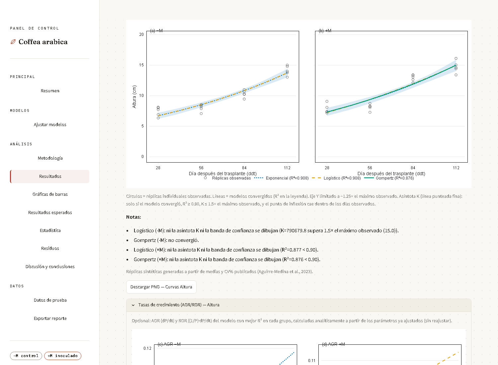
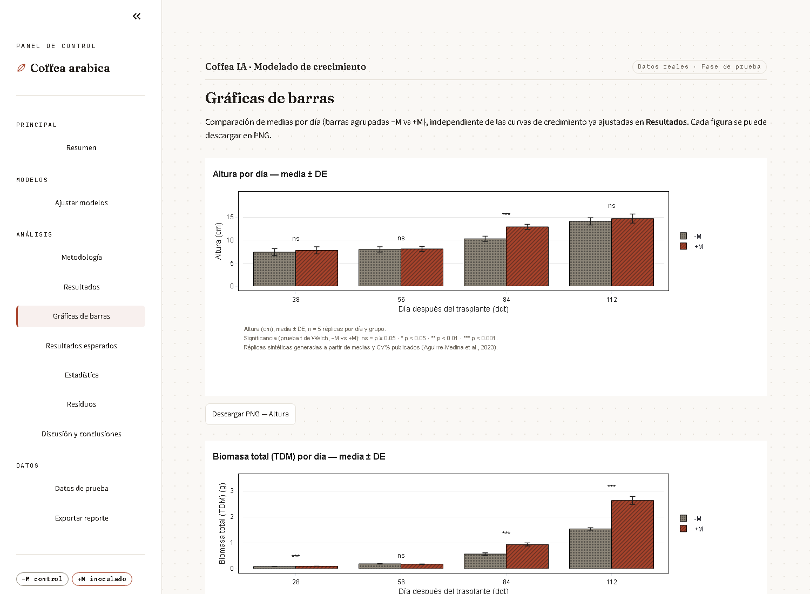
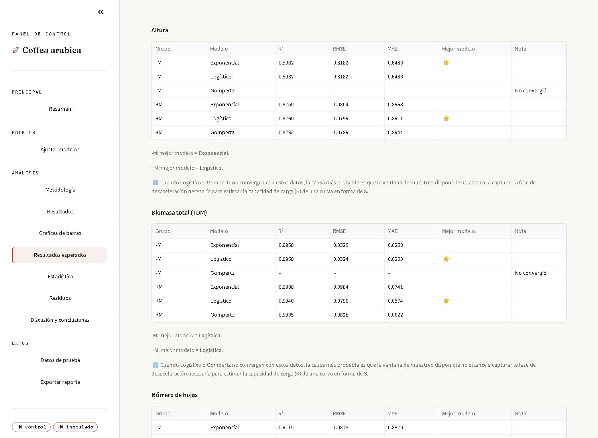

# Coffea IA · Modelado de crecimiento


**Desarrollado por:** Richard Montez, Diego Barrios, Santiago Uribe y Oscar Llanos

Aplicación en Streamlit que ajusta y compara tres modelos matemáticos de
crecimiento (**Exponencial**, **Logístico**, **Gompertz**) sobre datos de
altura, área foliar, biomasa total, número de hojas y diámetro del tallo de
*Coffea arabica*, comparando un grupo control sin inocular (**−M**) frente a
un grupo inoculado con Hongos Micorrízicos Arbusculares (**+M**).

El ajuste es una regresión no lineal por mínimos cuadrados (`scipy.optimize.curve_fit`)
sobre los tres modelos — no hay ningún componente de aprendizaje automático ni
entrenamiento de modelos predictivos.

## Capturas

**Resumen**


**Ajustar modelos** — configuración del ajuste y resultado inmediato con
badges de bondad de ajuste (R²) por grupo y modelo


**Metodología** — explicación de cada modelo con tratamiento editorial


**Resultados** — curvas ajustadas por variable, con círculos de réplicas
individuales, banda de confianza del 95% y asíntota K solo cuando es
estadísticamente plausible (ver [Metodología y limitaciones](#metodología-y-limitaciones-conocidas))


**Tasas de crecimiento (AGR/RGR)** — opcional, dentro de Resultados: tasa
de crecimiento absoluta y relativa del modelo con mejor R² en cada grupo,
calculadas analíticamente a partir de los parámetros ya ajustados (sin
reajustar el modelo)



**Gráficas de barras** — barras agrupadas −M vs +M por variable y día, con
patrón de trama además de color, marcas de significancia (prueba t de
Welch) y una comparación de R² por modelo en cuadrícula 2×2



**Resultados esperados** — tabla del modelo con mejor ajuste por variable y
grupo, y el efecto de la inoculación (+M vs −M) con prueba t, generadas
automáticamente a partir de los datos cargados



**Estadística** — intervalos de confianza y prueba t de Welch entre −M y +M


**Residuos** — diagnóstico de ajuste por modelo y grupo


## Funcionalidades

La navegación de la app tiene estas secciones:

- **Resumen** — estado general del ajuste actual.
- **Ajustar modelos** — corre `curve_fit` para los tres modelos sobre cada
  variable y grupo.
- **Metodología** — explica cada modelo (fórmula, parámetros, cuándo se
  espera que ajuste bien).
- **Resultados** — curvas ajustadas por variable (panel −M / panel +M),
  con réplicas observadas, banda de confianza del 95% y, dentro de un
  expander, las tasas de crecimiento AGR/RGR.
- **Gráficas de barras** — barras de medias ± DE por día con significancia
  estadística, y comparación de R² por modelo en una cuadrícula 2×2.
- **Resultados esperados** — mejor modelo por variable/grupo y tabla del
  efecto de la inoculación (+M vs −M) con la prueba t.
- **Estadística** — intervalos de confianza por parámetro y prueba t de
  Welch.
- **Residuos** — gráficas de residuos por modelo y grupo.
- **Discusión y conclusiones** — lectura editorial de los resultados.
- **Datos de prueba** — generación de datos simulados o carga de un Excel
  propio (o el real incluido en `datos_reales/`).
- **Exportar reporte** — genera el PDF con metodología, tablas y las
  mismas gráficas mostradas en la app.

## Métricas y rigor estadístico

- **Bondad de ajuste**: R², RMSE y MAE por modelo, variable y grupo.
- **Incertidumbre de los parámetros**: intervalos de confianza calculados a
  partir de la matriz de covarianza que devuelve `curve_fit`.
- **Comparación −M vs +M**: prueba t de Welch (`scipy.stats.ttest_ind`,
  `equal_var=False`) por variable y día, con codificación de significancia
  ns / \* / \*\* / \*\*\* (p ≥ 0.05, p < 0.05, p < 0.01, p < 0.001).
- **Regla de "no inventar un ajuste"**: cada modelo necesita un mínimo de
  días distintos de muestreo para ser identificable (Exponencial ≥ 2 días;
  Logístico y Gompertz ≥ 3, por su número de parámetros). Si un dataset no
  llega a ese mínimo, o si `curve_fit` no converge, la app nunca fuerza ni
  aproxima un ajuste: marca el estado como **"Sin días suficientes"** o
  **"No convergió"** y lo deja fuera de gráficas y tablas en vez de mostrar
  un R² falso.

## Datos reales

Los datos reales incluidos (`datos_reales/datos_reales_coffea_2023.xlsx`)
corresponden al Cuadro 2 de:

> Aguirre-Medina, J. F.; Aguirre-Cadena, J. F.; Escobar-España, J. C.;
> López-González, J. L. (2023). Crecimiento de *Coffea arabica* L. cv Catimor
> biofertilizado con diversos aislamientos de hongos endomicorrízicos en vivero.
> *Revista Fitotecnia Mexicana*, 46(3), 273-281.
> DOI: [10.35196/rfm.2023.3.273](https://doi.org/10.35196/rfm.2023.3.273)

Altura, número de hojas, área foliar y biomasa total en 4 momentos de
muestreo (28, 56, 84 y 112 días después del trasplante), 5 réplicas por
grupo y día. La variable diámetro del tallo no está en el paper y sigue
usando datos simulados.

El archivo tiene dos hojas: `datos` (columnas `variable`, `grupo`, `dat`,
`replica`, `valor` — este es también el formato que espera la app para
cargar un Excel propio) y `notas` (texto con la cita completa).

**Nota metodológica importante:** el paper solo reporta media y desviación
estándar (o CV%) por tratamiento y día — no publica las mediciones planta
por planta. Las réplicas individuales cargadas en este archivo son
**sintéticas**: generadas para reproducir exactamente esos estadísticos
publicados, no mediciones reales por planta. En consecuencia, la prueba t
de Welch que la app calcula sobre estas réplicas reproduce la comparación
de medias del paper, pero **no es evidencia estadística independiente** —
el tamaño de muestra efectivo y la varianza entre réplicas individuales son
un artefacto de cómo se generaron los datos sintéticos, no observaciones
originales. Los p-values de esta sección deben leerse como una ilustración
de la metodología de la app, no como un resultado nuevo sobre el efecto de
la micorrización.

## Metodología y limitaciones conocidas

- **Ventana de muestreo limitada**: con los 4 días disponibles (28–112 ddt)
  la planta está sobre todo en fase de crecimiento acelerado y todavía no
  muestra el "codo" de desaceleración que Logístico y Gompertz necesitan
  para estimar su asíntota `K` de forma confiable. Con solo 4 puntos por
  grupo (1 grado de libertad para un modelo de 3 parámetros), **Gompertz
  frecuentemente no converge** en uno de los dos grupos (−M o +M, según la
  variable), y aun cuando converge, su `K` puede quedar mal identificada.
  Esto es una limitación esperada del diseño de muestreo del paper fuente,
  no un error de la aplicación.
- **Criterio para dibujar la asíntota K**: la app solo dibuja la línea de
  `K` (y su banda de confianza) si se cumplen las cuatro condiciones a la
  vez: (1) el modelo convergió, (2) R² ≥ 0.90, (3) `K` ≤ 1.5× el máximo
  observado en ese grupo y variable, y (4) el punto de inflexión del modelo
  cae dentro del rango de días efectivamente muestreados. Si alguna falla,
  la app lo dice explícitamente en el pie de la figura (por ejemplo,
  "Logístico (−M): K no se dibuja porque supera 1.5× el máximo observado")
  en vez de mostrar una extrapolación sin respaldo en los datos.
- **Validación disponible — solo interna**: `scripts/validacion_cruzada_real.py`
  hace un hold-out 80/20 repetido 200 veces sobre las réplicas sintéticas de
  cada variable/grupo/día, comparando la media del subconjunto de
  "entrenamiento" contra la del subconjunto de prueba escondido. Esto mide
  **qué tan estable es la media reportada** frente a qué réplicas
  específicas caen en la muestra — no valida que los modelos de crecimiento
  generalicen a datos nuevos ni a otras condiciones. **No existe, todavía,
  ninguna validación externa** de los modelos contra un dataset distinto al
  de Aguirre-Medina et al. (2023).

## Cómo correrla localmente

Probado con Python 3.11.

```bash
git clone https://github.com/0scar07/proyecto-coffea-hma.git
cd proyecto-coffea-hma
python -m venv .venv
.venv\Scripts\activate        # Windows; en Linux/Mac: source .venv/bin/activate
pip install -r app/requirements.txt
streamlit run app/app.py
```

La app abre en `http://localhost:8501`. Por defecto arranca con datos
simulados; para probar con datos reales, ve a **Datos de prueba** y sube un
archivo en el formato de la plantilla descargable (o el Excel real incluido
en `datos_reales/`).

## Estructura del proyecto

```
proyecto-coffea-hma/
├── app/
│   ├── app.py                  # app de Streamlit (única fuente de la lógica y el UI)
│   ├── requirements.txt
│   └── .streamlit/
│       └── config.toml         # tema nativo de Streamlit (paleta "Cuaderno de campo")
├── datos_reales/
│   └── datos_reales_coffea_2023.xlsx   # datos del Cuadro 2 de Aguirre-Medina et al. (2023)
├── scripts/
│   └── validacion_cruzada_real.py      # validación cruzada (hold-out) sobre los datos reales
└── docs/
    ├── screenshots/             # capturas de la app usadas en este README
    ├── figuras/                 # gráficas individuales exportadas en PNG
    └── reportes/                # PDF de ejemplo generado por la app
```

## Cómo usarla

1. En **Datos de prueba**, elige la fuente: datos simulados (por defecto) o
   sube un Excel propio / el real de `datos_reales/`.
2. Ve a **Ajustar modelos** y presiona el botón — corre `curve_fit` para
   Exponencial, Logístico y Gompertz sobre cada variable y grupo.
3. Revisa **Resultados**, **Gráficas de barras** y **Estadística** para
   comparar el ajuste, la significancia −M vs +M y las tasas de
   crecimiento.
4. Descarga las gráficas individuales en PNG desde los botones bajo cada
   figura.
5. Genera el reporte completo en **Exportar reporte**.

## Desplegar en Streamlit Cloud

1. En [share.streamlit.io](https://share.streamlit.io), **New app**.
2. Repositorio: `0scar07/proyecto-coffea-hma`, rama `master`.
3. **Main file path**: `app/app.py`.
4. Deploy — Streamlit Cloud toma automáticamente `app/requirements.txt` y
   `app/.streamlit/config.toml` porque están junto al archivo principal.

Si se actualiza el código y la app desplegada no refleja los cambios,
usa **"Reboot app"** desde el menú de la app en Streamlit Cloud para forzar
un proceso nuevo (limpia cualquier caché de `@st.cache_data` que haya
quedado de una versión anterior).

## Trabajo futuro (pendiente)

- **Validación externa**: contrastar los modelos contra un dataset de
  crecimiento de *Coffea arabica* distinto al de Aguirre-Medina et al.
  (2023), idealmente uno con más momentos de muestreo que cubran también la
  fase de desaceleración.
- **App móvil**: una versión en Flutter + FastAPI está contemplada como
  proyecto separado (repo propio, aún sin publicar) — no reemplaza esta app
  de Streamlit, sería un cliente adicional.

## Cómo citar

Si usas este proyecto o su código, por favor cita:

> Montez, R.; Barrios, D.; Uribe, S.; Llanos, O. (2026). *Coffea IA:
> modelado y comparación de curvas de crecimiento (Exponencial, Logístico,
> Gompertz) en Coffea arabica* [Software]. [Institución/asignatura pendiente
> de especificar]. https://github.com/0scar07/proyecto-coffea-hma

Y, para los datos reales incluidos, cita también el paper original:

> Aguirre-Medina, J. F.; Aguirre-Cadena, J. F.; Escobar-España, J. C.;
> López-González, J. L. (2023). Crecimiento de *Coffea arabica* L. cv Catimor
> biofertilizado con diversos aislamientos de hongos endomicorrízicos en vivero.
> *Revista Fitotecnia Mexicana*, 46(3), 273-281.
> DOI: [10.35196/rfm.2023.3.273](https://doi.org/10.35196/rfm.2023.3.273)

## Licencia

Distribuido bajo licencia [MIT](LICENSE).
