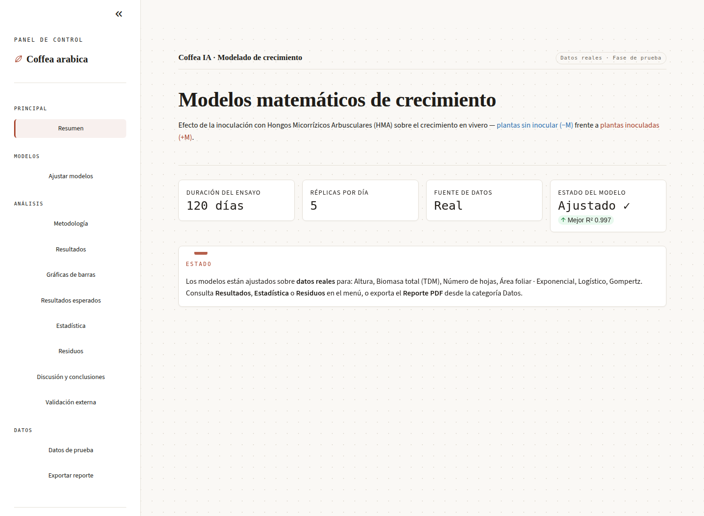
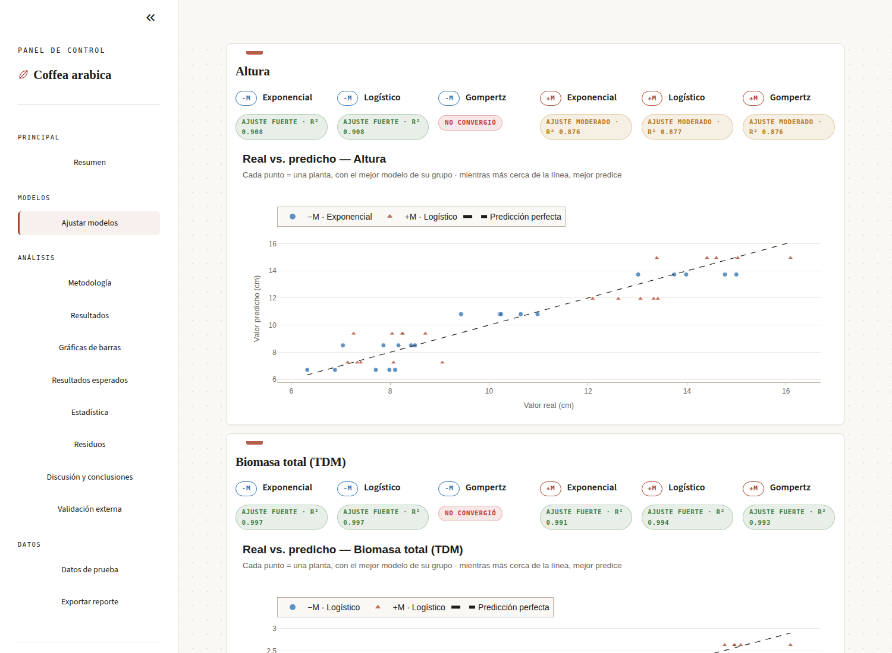
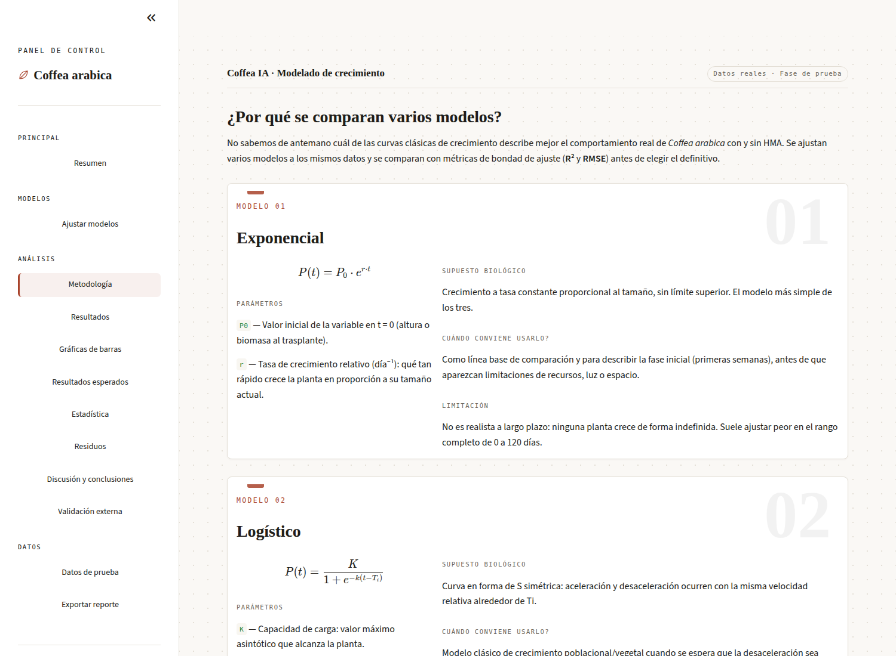
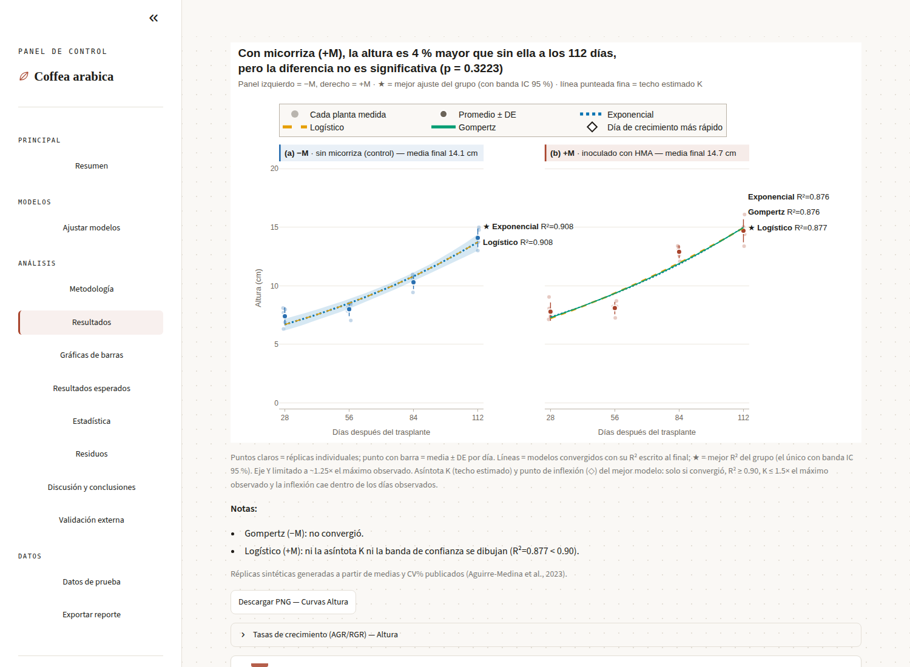
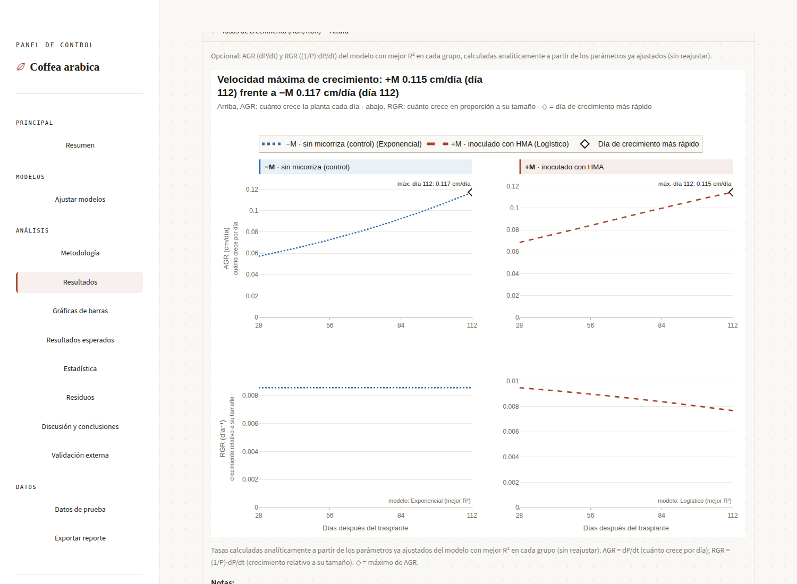
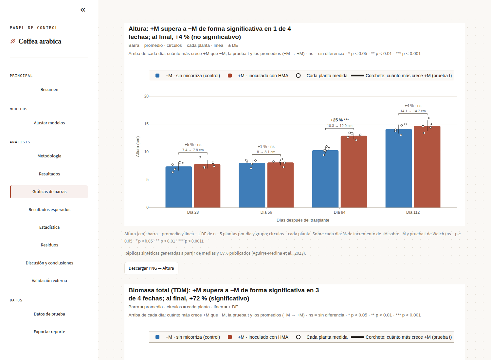
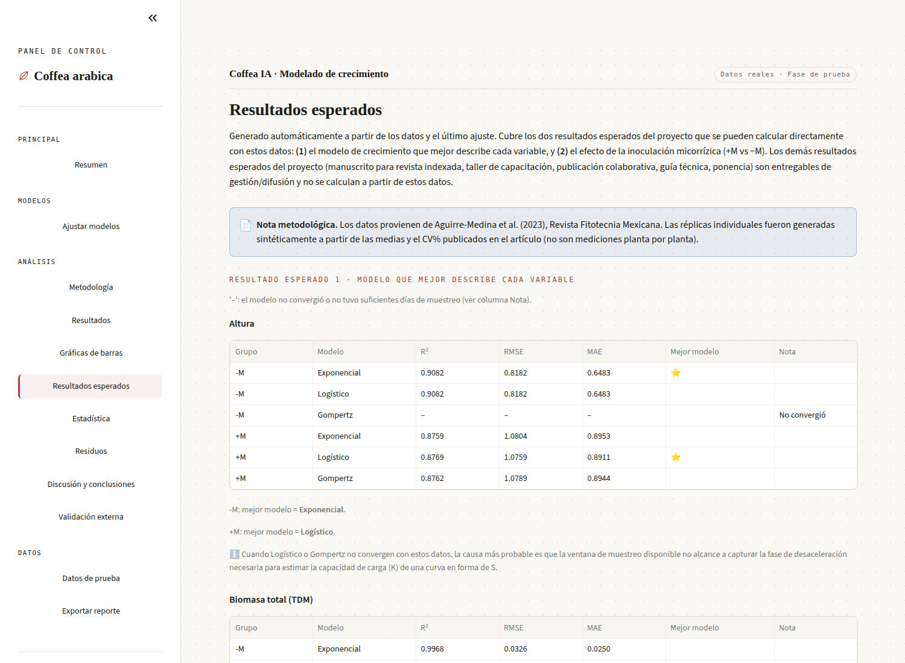
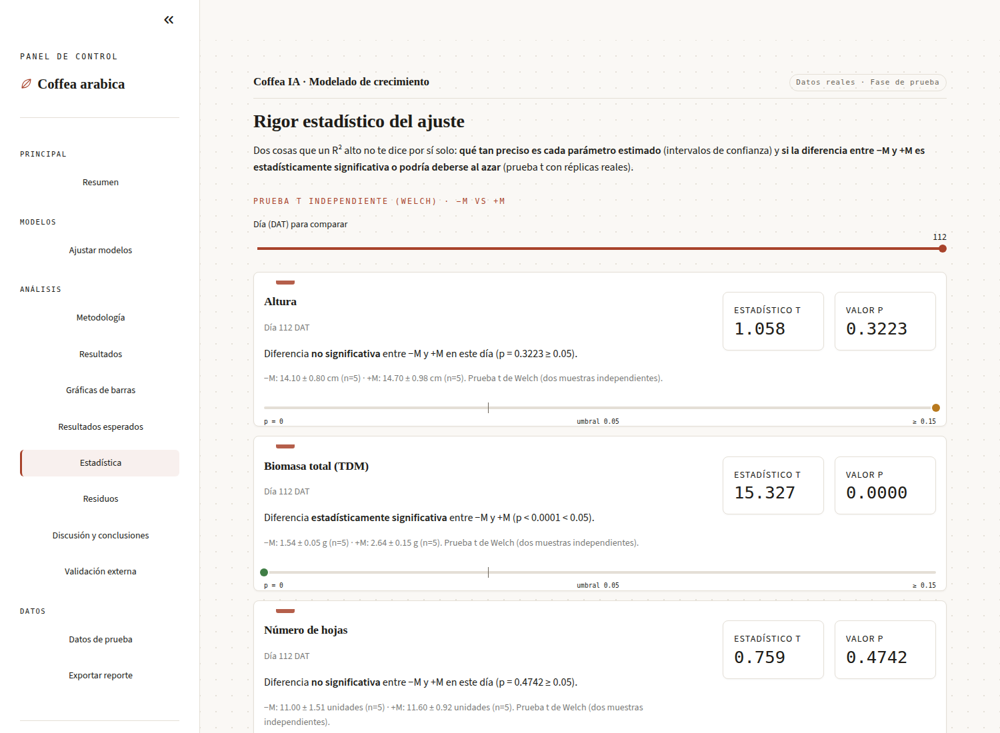
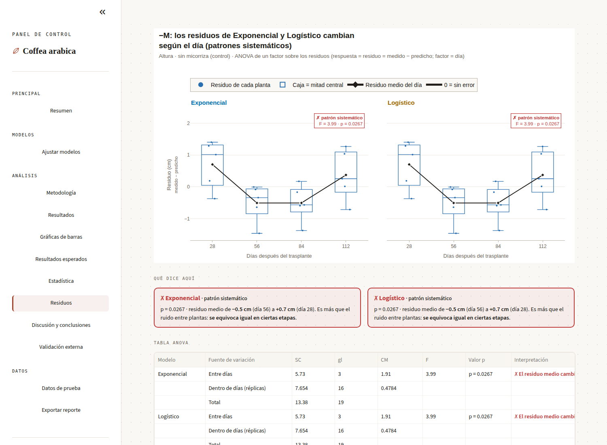

# Coffea IA · Modelado de crecimiento


  


**Desarrollado por:** Richard Montes, Diego Barrios, Santiago Uribe y Oscar Llanos

Aplicación en Streamlit que ajusta y compara tres modelos matemáticos de
crecimiento (**Exponencial**, **Logístico**, **Gompertz**) sobre datos de
altura, área foliar, biomasa total, número de hojas y diámetro del tallo de
*Coffea arabica*, comparando un grupo control sin inocular (**−M**) frente a
un grupo inoculado con Hongos Micorrízicos Arbusculares (**+M**).

El ajuste es una regresión no lineal por mínimos cuadrados (`scipy.optimize.curve_fit`)
sobre los tres modelos — no hay ningún componente de aprendizaje automático ni
entrenamiento de modelos predictivos.

## Capturas

**Resumen**



**Ajustar modelos** — configuración del ajuste y resultado inmediato con
badges de bondad de ajuste (R²) por grupo y modelo



**Metodología** — explicación de cada modelo con tratamiento editorial



**Resultados** — curvas ajustadas por variable, con círculos de réplicas
individuales, banda de confianza del 95% y asíntota K solo cuando es
estadísticamente plausible (ver [Metodología y limitaciones](#metodología-y-limitaciones-conocidas))



**Tasas de crecimiento (AGR/RGR)** — opcional, dentro de Resultados: tasa
de crecimiento absoluta y relativa del modelo con mejor R² en cada grupo,
calculadas analíticamente a partir de los parámetros ya ajustados (sin
reajustar el modelo)



**Gráficas de barras** — barras −M vs +M por variable y día con cada planta
como un círculo, y sobre cada día cuánto más crece +M (%) con su significancia
(prueba t de Welch); un resumen del efecto de la micorriza al final del ensayo
por variable, y el R² de cada modelo en una tabla de colores



**Resultados esperados** — tabla del modelo con mejor ajuste por variable y
grupo, y el efecto de la inoculación (+M vs −M) con prueba t, generadas
automáticamente a partir de los datos cargados



**Estadística** — intervalos de confianza y prueba t de Welch entre −M y +M



**Residuos** — ANOVA aplicado a los residuos: ¿el error del modelo cambia según el
día (patrón sistemático)? y ¿qué modelo se equivoca menos? (con letras de Tukey).
Cada gráfica trae debajo «Qué dice aquí», «Cómo leer esta gráfica», la tabla ANOVA
y el significado de cada columna



## Funcionalidades

La navegación de la app tiene estas secciones:

- **Resumen** — estado general del ajuste actual.
- **Ajustar modelos** — corre `curve_fit` para los tres modelos sobre cada
  variable y grupo.
- **Metodología** — explica cada modelo (fórmula, parámetros, cuándo se
  espera que ajuste bien).
- **Resultados** — curvas ajustadas por variable (panel −M / panel +M),
  con réplicas observadas, banda de confianza del 95% y, dentro de un
  expander, las tasas de crecimiento AGR/RGR.
- **Gráficas de barras** — barras de medias ± DE por día con el % de efecto y
  su significancia, resumen del efecto final por variable y tabla de R² por modelo.
- **Resultados esperados** — mejor modelo por variable/grupo y tabla del
  efecto de la inoculación (+M vs −M) con la prueba t.
- **Estadística** — intervalos de confianza por parámetro y prueba t de
  Welch.
- **Residuos** — ANOVA de residuos (residuo ~ día y |residuo| ~ modelo con
  Tukey), con explicación de cada gráfica y de cada columna de la tabla.
- **Discusión y conclusiones** — lectura editorial de los resultados.
- **Concordancia con el paper** — compara lo que concluyeron los autores del
  paper de origen con lo que obtiene la app con esos mismos datos. Ver
  [Concordancia con el paper de origen](#concordancia-con-el-paper-de-origen).
- **Validación externa** — compara lo que predicen los modelos (ajustados a
  los datos reales) con los valores reales de un experimento independiente
  publicado. Ver [Validación externa](#validación-externa).
- **Datos de prueba** — generación de datos simulados, carga de un Excel
  propio (o el real incluido en `datos_reales/`) y carga del Excel de un
  paper externo para la validación.
- **Exportar reporte** — genera el PDF con metodología, tablas y las
  mismas gráficas mostradas en la app.

## Métricas y rigor estadístico

- **Bondad de ajuste**: R², RMSE y MAE por modelo, variable y grupo.
- **Incertidumbre de los parámetros**: intervalos de confianza calculados a
  partir de la matriz de covarianza que devuelve `curve_fit`.
- **Comparación −M vs +M**: prueba t de Welch (`scipy.stats.ttest_ind`,
  `equal_var=False`) por variable y día, con codificación de significancia
  ns / \* / \*\* / \*\*\* (p ≥ 0.05, p < 0.05, p < 0.01, p < 0.001).
- **Regla de "no inventar un ajuste"**: cada modelo necesita un mínimo de
  días distintos de muestreo para ser identificable (Exponencial ≥ 2 días;
  Logístico y Gompertz ≥ 3, por su número de parámetros). Si un dataset no
  llega a ese mínimo, o si `curve_fit` no converge, la app nunca fuerza ni
  aproxima un ajuste: marca el estado como **"Sin días suficientes"** o
  **"No convergió"** y lo deja fuera de gráficas y tablas en vez de mostrar
  un R² falso.

## Datos reales

Los datos reales incluidos (`datos_reales/datos_reales_coffea_2023.xlsx`)
corresponden al Cuadro 2 de:

> Aguirre-Medina, J. F.; Aguirre-Cadena, J. F.; Escobar-España, J. C.;
> López-González, J. L. (2023). Crecimiento de *Coffea arabica* L. cv Catimor
> biofertilizado con diversos aislamientos de hongos endomicorrízicos en vivero.
> *Revista Fitotecnia Mexicana*, 46(3), 273-281.
> DOI: [10.35196/rfm.2023.3.273](https://doi.org/10.35196/rfm.2023.3.273)

Altura, número de hojas, área foliar y biomasa total en 4 momentos de
muestreo (28, 56, 84 y 112 días después del trasplante), 5 réplicas por
grupo y día. La variable diámetro del tallo no está en el paper y sigue
usando datos simulados.

El archivo tiene cuatro hojas: `datos` (columnas `variable`, `grupo`, `dat`,
`replica`, `valor` — este es también el formato que espera la app para
cargar un Excel propio), `notas` (texto con la cita completa), y
`paper_resultados` y `paper_conclusiones` (resultados y conclusiones del
paper, usados por la sección [Concordancia con el paper de
origen](#concordancia-con-el-paper-de-origen)).

**Nota metodológica importante:** el paper solo reporta media y desviación
estándar (o CV%) por tratamiento y día — no publica las mediciones planta
por planta. Las réplicas individuales cargadas en este archivo son
**sintéticas**: generadas para reproducir exactamente esos estadísticos
publicados, no mediciones reales por planta. En consecuencia, la prueba t
de Welch que la app calcula sobre estas réplicas reproduce la comparación
de medias del paper, pero **no es evidencia estadística independiente** —
el tamaño de muestra efectivo y la varianza entre réplicas individuales son
un artefacto de cómo se generaron los datos sintéticos, no observaciones
originales. Los p-values de esta sección deben leerse como una ilustración
de la metodología de la app, no como un resultado nuevo sobre el efecto de
la micorrización.

## Metodología y limitaciones conocidas

- **Ventana de muestreo limitada**: con los 4 días disponibles (28–112 ddt)
  la planta está sobre todo en fase de crecimiento acelerado y todavía no
  muestra el "codo" de desaceleración que Logístico y Gompertz necesitan
  para estimar su asíntota `K` de forma confiable. Con solo 4 puntos por
  grupo (1 grado de libertad para un modelo de 3 parámetros), **Gompertz
  frecuentemente no converge** en uno de los dos grupos (−M o +M, según la
  variable), y aun cuando converge, su `K` puede quedar mal identificada.
  Esto es una limitación esperada del diseño de muestreo del paper fuente,
  no un error de la aplicación.
- **Criterio para dibujar la asíntota K**: la app solo dibuja la línea de
  `K` (y su banda de confianza) si se cumplen las cuatro condiciones a la
  vez: (1) el modelo convergió, (2) R² ≥ 0.90, (3) `K` ≤ 1.5× el máximo
  observado en ese grupo y variable, y (4) el punto de inflexión del modelo
  cae dentro del rango de días efectivamente muestreados. Si alguna falla,
  la app lo dice explícitamente en el pie de la figura (por ejemplo,
  "Logístico (−M): K no se dibuja porque supera 1.5× el máximo observado")
  en vez de mostrar una extrapolación sin respaldo en los datos.
- **Validación disponible — solo interna**: `scripts/validacion_cruzada_real.py`
  hace un hold-out 80/20 repetido 200 veces sobre las réplicas sintéticas de
  cada variable/grupo/día, comparando la media del subconjunto de
  "entrenamiento" contra la del subconjunto de prueba escondido. Esto mide
  **qué tan estable es la media reportada** frente a qué réplicas
  específicas caen en la muestra — no valida que los modelos de crecimiento
  generalicen a datos nuevos ni a otras condiciones.
- **Validación externa**: se hace dentro de la app, en la sección
  **Validación externa** (ver [Validación externa](#validación-externa)),
  contra datos de experimentos distintos al de Aguirre-Medina et al. (2023).
  Un análisis previo de la metodología contra otros tres estudios (León-Burgos,
  Siqueira, Vallejos-Torres) está en
  [docs/validacion_externa/informe.md](docs/validacion_externa/informe.md).

## Concordancia con el paper de origen

La sección **Concordancia con el paper** compara lo que **concluyeron los
autores** del paper del que salen los datos reales (Aguirre-Medina et al.
2023) con lo que **obtiene la app** a partir de esos mismos datos. No es una
validación externa —los datos son los mismos—: comprueba que la app los
describe bien y llega a las mismas conclusiones. Tiene un resumen y tres
partes:

- **Resumen**: error medio de las curvas frente a los valores publicados
  (**13.3 %**), coincidencia en la significancia (**11 de 11** casos
  evaluables) y en el signo del efecto del hongo según las curvas (**14 de
  16**).
1. **Valores: paper vs app, por variable**: para cada día, el valor
   publicado en el Cuadro 2 (pág. 276) junto al valor que da la curva que la
   app ajustó a esos datos (el modelo de mejor R² en cada grupo), con su error
   y una gráfica de puntos del paper y curvas de la app. Aquí la app no predice
   datos nuevos: el error mide qué tan bien la curva describe los datos. Los
   errores grandes se concentran en el primer muestreo (28 ddt), donde los
   valores son muy pequeños.
2. **¿La diferencia −M vs +M es significativa?**: lo que dice el paper (letras
   de Tukey; dos tratamientos difieren si no comparten ninguna letra) frente a
   lo que dice la app (prueba t de Welch). La biomasa total no tiene letras en
   el paper (las da por parte: raíz, tallo y lámina), por eso no se compara.
3. **Conclusiones de los autores** (pág. 279) frente a la evidencia de la app.
   Las conclusiones sobre crecimiento quedan respaldadas en parte (+M supera a
   −M en 14 de 16 casos, pero no siempre de forma significativa con *R.
   intraradices*); la del fósforo no es evaluable porque la app no lo mide.

Los resultados y conclusiones del paper no están fijos en el código: se leen
de las hojas `paper_resultados` (`variable`, `dia`, `media_menos`,
`letra_menos`, `media_mas`, `letra_mas`, `fuente`, `nota`) y
`paper_conclusiones` (`conclusion`, `pagina`, `variables`, `dias`) del Excel
de datos reales. Si se carga otro Excel con esas hojas, la sección funciona
igual.

Precauciones: el paper compara 7 tratamientos con Tukey y la app solo −M y +M
con Welch sobre réplicas sintéticas, así que en casos límite pueden diferir;
y el paper se centra en cinco aislamientos nativos, mientras que la app solo
usa el testigo y la referencia *R. intraradices*.

## Validación externa

La sección **Validación externa** comprueba si las curvas ajustadas a los
datos reales describen el crecimiento de plantas de **otro experimento**
publicado, que los modelos nunca vieron. No hay entrenamiento: los modelos
se ajustan por mínimos cuadrados no lineales (`curve_fit`) y después se usan
tal cual, con sus parámetros fijos.

**Cómo funciona**

1. Los tres modelos se **ajustan** a los datos reales activos (o, si no se
   cargó ninguno, a `datos_reales/datos_reales_coffea_2023.xlsx`).
2. Con esas curvas ya ajustadas se **predice** el valor de cada variable en
   los días que midió el paper externo.
3. Se **compara** lo predicho con lo que el paper midió: error por fecha,
   R², RMSE, MAE y error medio (%).

**Pestañas**

| Pestaña | Qué muestra |
|---|---|
| 1 · Lo que predice el modelo | Valor predicho para −M y +M en el día que se elija |
| 2 · Predicho vs real | **Validación externa propiamente dicha**: tabla Día · Predicho · Real · Error y gráfica predicho vs real |
| 3 · Fechas no vistas | Los modelos se ajustan solo a las primeras fechas del paper y predicen las últimas (pone a prueba la forma de las curvas) |
| 4 · Efecto del hongo | Efecto real (+M vs −M) frente al que dan las curvas, con prueba t de Welch si el paper reporta DE y n |
| 5 · Datos del paper | Valores cargados y qué validaciones permite cada variable |

La columna **Tramo** indica si cada día del paper cae dentro del rango de
días medido en los datos reales (28–112 ddt → "medido") o fuera
("extrapolación"). Las predicciones solo son defendibles dentro del tramo
medido.

**Cargar un paper**: en **Datos de prueba → Datos externos para validación
(paper)** se descarga la plantilla y se sube el Excel del paper. La hoja
`datos` lleva una fila por variable, grupo y fecha (`variable`, `grupo`,
`dia`, `media`, y opcionalmente `de` y `n`); también acepta réplicas
(`valor`). La hoja `info` indica la cita y desde cuándo cuenta los días el
paper (`trasplante`, `siembra` o `inoculacion`); si no es el trasplante, la
app estima la alineación del tiempo comparando el tamaño de las plantas.

**Papers incluidos** (`datos_reales/validacion_externa/`, cada Excel con una
hoja `de_donde_sale` que indica el cuadro o figura de cada valor):

| Archivo | Paper | Especie | −M / +M | Fechas | De dónde salen los valores |
|---|---|---|---|---|---|
| `franca_2014_catuai.xlsx` | França et al. (2014), *Rev. Bras. Ciências Agrárias* 9(4):506-511 | *C. arabica* Catuaí | Sin inocular / *G. clarum* + *Gi. margarita* | 0–150 días después del trasplante | Figuras 1-3 (pág. 508), **digitalizadas** (precisión ≈ ±1 % del eje) |
| `aguirre_medina_2011.xlsx` | Aguirre-Medina et al. (2011), *Agronomía Mesoamericana* 22(1):71-80 | *C. arabica* Oro Azteca | Testigo / *G. intraradices* | 60–210 días después de la siembra | Cuadros 1 y 2 (págs. 74-75); biomasa = raíz + tallo + lámina |
| `ibarra_puon_2014_suelo_arena.xlsx`, `..._suelo_pulpa.xlsx` | Ibarra-Puón et al. (2014), *Rev. Chapingo Serie Horticultura* 20(2):201-213 | *C. canephora* (robusta) — solo apoyo | Testigo / *R. intraradices* | 28–140 ddt | Cuadros 1 y 2 (págs. 206 y 208) |

**Lectura de los resultados**: la altura es la variable que mejor se
transfiere a otros experimentos (error de ~4–11 % dentro del tramo medido en
França 2014). La biomasa y el área foliar fallan en valor absoluto porque
las plantas de otros viveros acumulan distinta biomasa a la misma edad: los
parámetros ajustados no se transfieren entre sistemas de producción y
habría que volver a ajustarlos para cada uno. Ibarra-Puón (2014) es otra
especie y solo debe usarse como referencia complementaria.

## Cómo correrla localmente

Probado con Python 3.11.

```bash
git clone https://github.com/0scar07/proyecto-coffea-hma.git
cd proyecto-coffea-hma
python -m venv .venv
.venv\Scripts\activate        # Windows; en Linux/Mac: source .venv/bin/activate
pip install -r app/requirements.txt
streamlit run app/app.py
```

La app abre en `http://localhost:8501`. Por defecto arranca con datos
simulados; para probar con datos reales, ve a **Datos de prueba** y sube un
archivo en el formato de la plantilla descargable (o el Excel real incluido
en `datos_reales/`).

## Estructura del proyecto

```
proyecto-coffea-hma/
├── app/
│   ├── app.py                  # app de Streamlit (única fuente de la lógica y el UI)
│   ├── requirements.txt
│   └── .streamlit/
│       └── config.toml         # tema nativo de Streamlit (paleta "Cuaderno de campo")
├── datos_reales/
│   ├── datos_reales_coffea_2023.xlsx   # datos del Cuadro 2 de Aguirre-Medina et al. (2023)
│   └── validacion_externa/             # Excel de papers externos para la sección Validación externa
├── scripts/
│   └── validacion_cruzada_real.py      # validación cruzada (hold-out) sobre los datos reales
├── docs/
│   ├── screenshots/             # capturas de la app usadas en este README
│   ├── figuras/                 # gráficas individuales exportadas en PNG
│   ├── reportes/                # PDF de ejemplo generado por la app
│   └── documentacion/           # documentación técnica del código (ver enlace más abajo)
└── entregables/                 # borradores y plantillas de gestión/difusión (ver entregables/README.md)
```

Documentación técnica del código, navegable en el navegador: [docs/documentacion/index.html](docs/documentacion/index.html).

## Cómo usarla

1. En **Datos de prueba**, elige la fuente: datos simulados (por defecto) o
   sube un Excel propio / el real de `datos_reales/`.
2. Ve a **Ajustar modelos** y presiona el botón — corre `curve_fit` para
   Exponencial, Logístico y Gompertz sobre cada variable y grupo.
3. Revisa **Resultados**, **Gráficas de barras** y **Estadística** para
   comparar el ajuste, la significancia −M vs +M y las tasas de
   crecimiento.
4. Descarga las gráficas individuales en PNG desde los botones bajo cada
   figura.
5. Abre **Concordancia con el paper** para comparar las conclusiones de los
   autores del paper de origen con los resultados de la app.
6. Para la validación externa: en **Datos de prueba → Datos externos para
   validación (paper)** sube uno de los Excel de
   `datos_reales/validacion_externa/` y abre **Validación externa**.
7. Genera el reporte completo en **Exportar reporte**.

## Desplegar en Streamlit Cloud

1. En [share.streamlit.io](https://share.streamlit.io), **New app**.
2. Repositorio: `0scar07/proyecto-coffea-hma`, rama `master`.
3. **Main file path**: `app/app.py`.
4. Deploy — Streamlit Cloud toma automáticamente `app/requirements.txt` y
   `app/.streamlit/config.toml` porque están junto al archivo principal.

Si se actualiza el código y la app desplegada no refleja los cambios,
usa **"Reboot app"** desde el menú de la app en Streamlit Cloud para forzar
un proceso nuevo (limpia cualquier caché de `@st.cache_data` que haya
quedado de una versión anterior).

## Trabajo futuro (en proceso)

- **Ampliar la validación externa**: sumar papers de *Coffea arabica* con
  datos por fecha publicados en tablas (no solo figuras) y con muestreos
  más allá de 112 ddt, e incluir la validación externa en el reporte PDF.
- **App móvil**: una versión en Flutter + FastAPI está contemplada como
  proyecto separado (repo propio, aún sin publicar) — no reemplaza esta app
  de Streamlit, sería un cliente adicional.

## Cómo citar

Si usas este proyecto o su código, por favor cita:

> Montez, R.; Barrios, D.; Uribe, S.; Llanos, O. (2026). *Coffea IA:
> modelado y comparación de curvas de crecimiento (Exponencial, Logístico,
> Gompertz) en Coffea arabica* [Software]. [Institución/asignatura pendiente
> de especificar]. https://github.com/0scar07/proyecto-coffea-hma

Y, para los datos reales incluidos, cita también el paper original:

> Aguirre-Medina, J. F.; Aguirre-Cadena, J. F.; Escobar-España, J. C.;
> López-González, J. L. (2023). Crecimiento de *Coffea arabica* L. cv Catimor
> biofertilizado con diversos aislamientos de hongos endomicorrízicos en vivero.
> *Revista Fitotecnia Mexicana*, 46(3), 273-281.
> DOI: [10.35196/rfm.2023.3.273](https://doi.org/10.35196/rfm.2023.3.273)

## Licencia

Distribuido bajo licencia [MIT](LICENSE).
